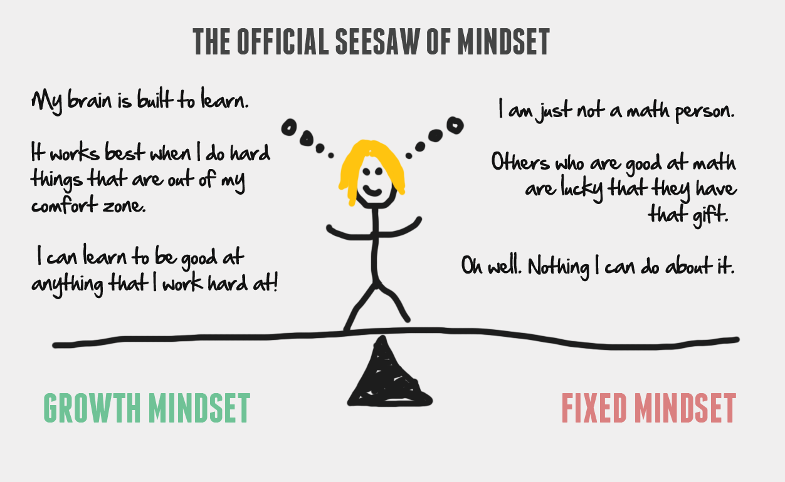

# What is this guide? 

* Audience: R beginners looking to start using R for statistical analysis and data management. Undergraduate, graduate students looking to expand their ability beyond point-and-click analysis softwares.
* I have provided some [general tips](#tips-on-analysis-methods) at the end of the article if you don't want to go through my example. 
* I also talk about the right [mindset](#important-mindset-for-beginner-coders) when it comes to learning how to code at the end of the article. 
***
## Introduction
  
If you have never coded before, starting to write code in R for your statistical analysis is as daunting as facing an alien spaceship - You know there is so much to learn, but nowhere to start. Don't worry, this is the guide for you.  
  
In this guide, I will take you from obtaining a dataset to the statistical analysis. Of course for now, we will stick to the basic analysis methods to get you started. Once you have the basics covered and know your way around the alien spaceship, it is all yours to explore.  
  
As an essential tip for any reader who is struggling with code or reading this article, the first place you would look when you encouter a problem is the original R documentation. Don't worry if you don't know what this is, we will illustrate the importance of this as we go.  

> Pull it up, Jamie -- Joe Rogan

  Now, let's get some data to work with. Feel free to use your own data, and try to change certain variables from this guide to the corresponding variables in your dataset. Feel free to skip the data description part if you have your own data. 
  
### Get our data ready 

  The data used in this guide is a large-sample dataset of the **Rosenberg self-esteem scale (RSE)** obtained from [Open Psychometrics](https://openpsychometrics.org/_rawdata/), published in 2014. If you go ahead and download the .zip file, the details of the questions are logged in codebook.txt. Take a look at the excel file for now, and you will see that the original dataset has 47,974 participants. To not burn my laptop's poor CPU too hard, I have only chosen the first 1000 rows for this assignment. Feel free to use the entire dataset, but you might not get the same numbers as I did. So download this data into your R working directory and let's begin! 

  ### Load your data into R and clean it up

  The first step is obviously to organize the data into a usable format. Here, we use the tidyverse package. Packages in R are like appendages of the R program - if you need to chop you need an arm, and if you need to play soccer you need a leg. Installing them is like attaching them to the mainframe, and the line 'library' is to activate them for this session. 
  
```{r, eval=true, results=asis}
# Add hashtags if you have installed the packages
install.packages("tidyverse")
install.packages("psych")
install.packages("ggplot2")
install.packages("naniar")
install.packages("dplyr")
library(dplyr)
library(naniar)
library(psych)
library(ggplot2) 
library(tidyverse)
```
  Now let's read the data with the read_csv function. Coming back to our point about 'pulling it up', if you are not sure what this function does, you should try googling the function name + "documentation" to read the details. 
```{r, eval=true, results=asis}
# Assign the read data into a dataframe called "RSE.dat"
RSE.dat <- read_csv("./data.csv",col_types = cols())
```
  Here, you use the power of the "naniar" package to replace the missing data with N/A.
```{r, eval=true, results=asis}
RSE.dat <- replace_with_na_if(data = RSE.dat,
                              .predicate = is.numeric,
                              condition = ~.x == "0")
```
  Now, here comes a common problem. The Rosenberg self-esteem scale is typically measured from 0 to 3, but this dataset measures self-esteem from 1 to 4. So the following line subtracts 1 from everyone to fit that typical measuring scale
```{r, eval=true, results=asis}
RSE.dat[1:10] <- RSE.dat[1:10] - 1
```
  Congratulations! Now we have the data read and cleaned, let's see what we can do with it! 

  ### Scoring

  In this example, if we are interested in giving everyone a total score of their self-esteem, we would have to following the scoring method of the Rosenberg self-esteem scale. You can do it manually according to the guidelines of the scale. But that sounds like a lot of work...

  > Innovation comes from laziness -- Some wise person

  So I went searching for a pre-made scoring scale from geniuses of the internet, and I came across this website. In fact, if you google "Scoring Rosenberg self-esteem scale in R", [this website](https://rdrr.io/github/nrkoehler/qscorer/man/scoring_rses.html) will pop up.
  Follow their instruction find this R script file called "scoring_rses.R". If you can't downloaded it, simply make a new R script and copy paste the code and save! Now use the function "source" to tell R that you want to add an external function of your own like below! The ./ simply means to take it from your current working directory. (but prepare for an error!)

```{r, eval=true, results=asis}
# scoring
source("./scoring_rses.R")
RSE.dat <- scoring_rses(RSE.dat, items = 1:10)
```
   Now, if you followed my instruction, chances are you are going to get an error about minimum or maximum possible value. This is because our external scoring function sometimes do not match what our dataset. This requires some tweeking in the function file itself! Find the part in the function that indicates the Maximum and minimum. After some tweeking, your function should look like [this](scoring_rses.R). 

   If you are successful, you should be able to see a column named "score.rses"

   

### Preparing for analysis

   Now we have that sorted out, let's try recoding the data, which is basically making our data more readable by the computer instead of by the human brain. Here, we assign the value 1 for males, and 2 for females.
  
```{r, echo=True, eval=True, results=asis}
# recode
RSE.dat <- mutate(RSE.dat,
                  gender_recode = case_when(gender == 1 ~ "Male",
                                            gender == 2 ~ "Female"))
```

  Also, depending on our need, we can choose to omit the missing data by running the following lines. Again, I recommend searching the original documentation of those functions I am using to understand what is happening.

```{r,echo=True, eval=True, results=asis,fig.height=4}
vis_miss(RSE.dat)
# after visualization, I think we can discard missing data
RSE.dat <- na.omit(RSE.dat)
View(RSE.dat)
```

### Data Analysis

For this demostration, suppose we have an very simple question about the gender differences in self-esteem. Do men and women differ in self-esteem? We shall begin with descriptives and conduct a simple t-test.

```{r}
describe(RSE.dat$score.rses)
# plot the data
ggplot(data=RSE.dat, aes(score.rses)) + 
  geom_histogram(bins = 30, 
                 binwidth = 1, 
                 fill = "skyblue",
                 col=I("white")) +
  labs(title="Frequency distribution of RSE score",x="RSE scores") + 
  theme_classic()
```

For assumptions checks in R, check out this great [guide](https://www.sheffield.ac.uk/polopoly_fs/1.885202!/file/95_Normality_Check.pdf). Assumption checks usually takes the form of :
```{r}
shapiro_test(RSE.dat$score.rses)
```
Now for the t-test if our data passed the assumptions. Note that this isn't the only way to conduct the analysis. In this scenario, we created separated dataframes for the male and female score. 

```{r}
male.dat = filter(RSE.dat, gender_recode=="Male")
group1 = male.dat$score.rses
female.dat = filter(RSE.dat, gender_recode=="Female")
group2 = female.dat$score.rses
t.test(group1,group2)
```
From here, you can report your findings based on the results of the statistical tests. 


***
# Tips for the beyond

Our research question calls for a simple t-test. However, unless you are working on a undergraduate level thesis or course assignment, your analysis journey is unlikely to end at t-tests. You might wonder, how is this guide helpful for more complex analyses? Here, I provide a step-by-step guide on how to "look it up" and make it useful. 

1. How to look it up: "xxx statistical methods in R" 
2. Find a page with examples that involves data, not just theory. The tip here is to quickly scroll through the page, and if it doesn't have a box like this: 
```{r}
# a bunch of code 
```
Then skip this page until you find one with actual examples. 
3. Now let's say you have encountered an example like [this](http://www.sthda.com/english/wiki/manova-test-in-r-multivariate-analysis-of-variance): 
```
# MANOVA test
res.man <- manova(cbind(Sepal.Length, Petal.Length) ~ Species, data = iris)
summary(res.man)
```
4. Say you are not sure how to incorporate the function "manova" into your project? Try googling: "**manova R documentation**", and you will most likely see a documentation of some sorts like [this](https://www.rdocumentation.org/packages/MANOVA.RM/versions/0.4.2/topics/MANOVA). 

Then, skip the theory part, and immediately scroll down to this bottom, and look at the example. In this case: 
```
data(EEG)
EEG_mod <- MANOVA(resp ~ sex * diagnosis, 
                    data = EEG, subject = "id", resampling = "paramBS", 
                    alpha = 0.05, iter = 10, CPU = 1)
summary(EEG_mod)
```
With the example, it's easy to see that "**resp**" is probably the dependent variable, and "**sex**","**diagnosis**" are probably the independent variables. From there, mimic this format with your own data. Only going back to the top of this webpage for theory if you are not sure what an argument means. For example, you see **iter = 10** but you are not sure what this means. Go back to the top of the page and find this information: 

> **iter**: The number of iterations used for calculating the resampled statistic. The default option is 10,000.

Go back and forth to test it out in your own data until you figured out how to use the **MANOVA** function. And Vola! You just taught yourself how to conduct MANOVA in R!  
  
5. If you have an error, the obvious solution is to read the error message and trying to resolve the error. However, sometimes the issue is wider than your mispelling in one line of code. Consider building from something basic that you know works (e.g. a function with less arguments), and slowly build up to what you want. 
   
6. I can't stress this enough: 1 example is probably more helpful than a page full of explanations 
  ***
# Important mindset for beginner coders
  

  
Many people (professors and students included) never make the switch from the traditional point-and-click method to a more versatile tool like R for a reason --- it's hard. In fact, for any non-COMPSCI person to start coding is as hard as learning a new language. It is easy to get frustrated, and think of giving up. The following mindsets can be helpful in those situations:
  
* If you think your task at-hand is a relatively common task, such as filtering and recoding data, there is 100% a solution that is not only accessible but also easy to grasp. If you task is common and you find yourself into a rabbit hole of 1 webpage, snap out of it and try a new page.
  
* It is easy to start evaluating yourself during your practices, thinking that we are not smart enough to understand any of this. In my research, this is called self-referential processing that often activates regions of a brain network called the "default mode network", which is essentially the network for mind-wandering. When you notice yourself evaluating your own intellect instead of focusing on the task at hand, know that this is simply something that our brain does that tricks us, and it is up to you to fight that instinct to wander off into negative self-evaluation. We were all bad at coding, until we don't. The people who are actually bad at coding aren't bad it coding, they simply stopped and let their brain's default mode network take over. 

* If you do decide to ask for help from your professor or a fellow colleague, make sure you ask them about their process of finding the answer. Sometimes, simply knowing the existence of a forum or a person's blogpost makes a huge difference! 

### I hope you enjoyed this guide as much as I did writing it! 
  
<center> Share this article: </center>
 
